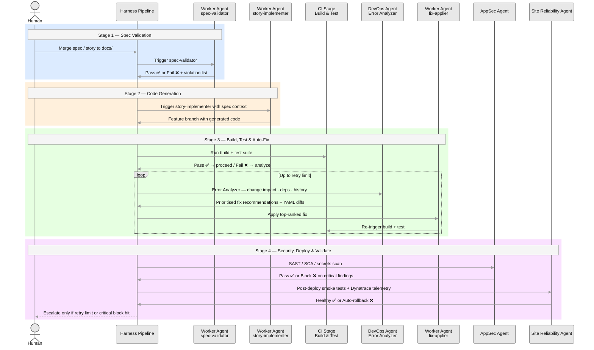

# Agentic CI/CD — Harness-Powered Autonomous Software Delivery

> **Work in progress.** This workspace is actively being built to integrate Harness CI/CD's agentic AI capabilities into the spec-driven development workflow. Pipeline design, agent configuration, Worker Agent definitions, and automation scripts are all under active construction.

---

## 1. What This Project Is

This project wires **Harness CI/CD** into the spec-driven development method as a fully autonomous delivery layer. Rather than using Harness as a conventional pipeline runner, the goal is to exploit its native **agentic AI** features — DevOps Agent, Worker Agents, Error Analyzer, and Site Reliability Agent — so that the pipeline itself can reason, self-correct, and address issues without human intervention at every step.

The end state is a delivery loop where a merged spec or story triggers a pipeline that plans, builds, tests, validates, and — if it fails — diagnoses and fixes the failure autonomously, looping back until the gate is passed or a human escalation is required.

**Methodology:** Spec-driven development · **Platform:** Harness CI/CD · **AI runtime:** Claude Opus 4.6 via AWS Bedrock / Google Vertex AI (Harness-hosted)

---

## 2. What Is Being Built

### Agentic Pipeline Stages

Each stage in the Harness pipeline is designed to be agent-driven rather than script-driven:

| Stage | Agent / Step | Purpose |
|---|---|---|
| **Spec Validation** | Worker Agent + MCP | Reads the committed spec or story file; validates completeness against constitution rules; blocks the pipeline if gate criteria are unmet |
| **Code Generation** | Worker Agent | Invokes the implementation agent with spec context; commits generated code to a feature branch |
| **Build & Test** | CI Stage | Standard Maven / pytest / Gradle build; test results published as pipeline outputs |
| **Error Analysis** | DevOps Agent — Error Analyzer | On any build or test failure: change-impact analysis, dependency inspection, historical pattern comparison; produces prioritised fix recommendations with before/after YAML |
| **Automatic Fix** | Worker Agent | Applies the top-ranked fix recommendation; re-triggers the Build & Test stage; loops up to a configurable retry limit |
| **Security Scan** | AppSec Agent | SAST / SCA / secrets scanning; blocks promotion on critical findings |
| **Deployment Validation** | Site Reliability Agent | Post-deploy smoke tests; Dynatrace Grail log telemetry analysis; automatic rollback on abnormal signals |
| **Release Orchestration** | Release Agent | Manages environment promotion (dev → staging → prod); enforces shadow-mode gate before any production cutover |

### Worker Agents in Use

Harness **Worker Agents** pair a prompt, a model connector (Claude or GPT), and optional MCP servers into a single reusable governed step. Each agent defined in this project is catalogued and versioned so it can be shared across pipelines:

| Agent Name | Trigger | MCP Connectors | Output |
|---|---|---|---|
| `spec-validator` | PR merge to `docs/` | Harness platform, GitHub | Pass / fail + violation list |
| `story-implementer` | Spec validation pass | Harness platform, GitHub | Feature branch with generated code |
| `fix-applier` | Error Analyzer output | Harness platform, GitHub | Patched branch commit |
| `cutover-gatekeeper` | Shadow-mode results | Harness platform, Dynatrace | Go / no-go decision + runbook entry |

---

## 3. Harness Agentic AI Capabilities Being Leveraged

The features below are what make autonomous issue addressal possible on this platform — no custom tooling required.

### DevOps Agent
The Harness DevOps Agent (Claude Opus 4.6 via Bedrock / Vertex) can create, modify, and validate pipelines, stages, services, environments, connectors, and secrets through natural language. In this project it is used to:
- Generate and maintain the pipeline YAML itself from natural-language descriptions of each stage
- Produce OPA Rego policies for compliance gates
- Handle bulk modifications across 50+ stage pipelines as scope grows

### Error Analyzer
Built into the DevOps Agent, the Error Analyzer performs failure diagnosis automatically on any pipeline execution:
- **Change impact analysis** — identifies recent commits or config changes that correlate with the failure
- **Dependency inspection** — checks upstream service and infra status
- **Historical pattern matching** — compares the failure signature against past runs
- **Prioritised fix recommendations** — ranked list with justifications and before/after YAML diffs

### Worker Agents
Reusable AI steps that run inside any CI, CD, IaCM, STO, SCS, or Custom stage. Each agent step expands into an isolated containerised step group at runtime. Outputs are published as pipeline variables consumable by downstream steps. This is the primitive used for `spec-validator`, `story-implementer`, and `fix-applier`.

### Site Reliability Agent
Post-deployment validation without manual monitoring:
- Integrates with Dynatrace Grail for AI-powered log telemetry analysis
- Detects abnormal signals and triggers automatic rollback
- Reduces mean time to recovery without human intervention in the loop

### MCP Integration
Harness's Model Context Protocol server connects agents to live platform data (pipeline state, service health, environment config) and external sources (GitHub PRs, issue trackers). MCP is the data layer that lets Worker Agents act on real pipeline context rather than synthetic prompts.

---

## 4. Planned Automation Scope

---

## 5. Project Status

| Component | Status |
|---|---|
| Pipeline YAML skeleton | 🔧 In progress |
| `spec-validator` Worker Agent | 🔧 In progress |
| `story-implementer` Worker Agent | 📋 Planned |
| `fix-applier` Worker Agent | 📋 Planned |
| Error Analyzer integration | 📋 Planned |
| AppSec Agent gate | 📋 Planned |
| Site Reliability Agent + Dynatrace | 📋 Planned |
| `cutover-gatekeeper` Worker Agent | 📋 Planned |
| End-to-end pipeline run | 📋 Planned |

---

## 6. References

- [Harness DevOps Agent — Developer Hub](https://developer.harness.io/docs/platform/harness-ai/devops-agent/)
- [Harness Worker Agents — Developer Hub](https://developer.harness.io/docs/platform/harness-ai/harness-agents/)
- [Harness AI October 2025 Updates](https://www.harness.io/blog/harness-ai-october-2025-updates)
- [Harness deploys AI agents across software delivery — SiliconANGLE](https://siliconangle.com/2025/08/26/harness-deploys-ai-agents-automate-every-aspect-software-delivery-code-generation/)
