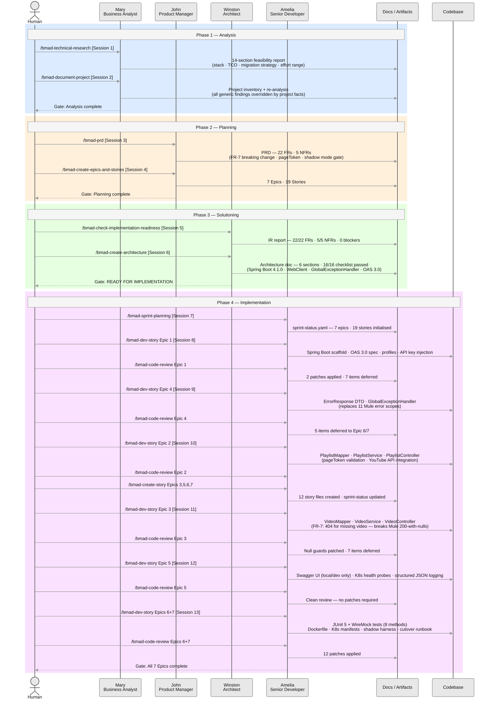

# Brownfield Implementation — YouTube Playlist API Migration

## 1. What This Project Is

This workspace documents and executes a **brownfield MuleSoft → Spring Boot migration** of an internal YouTube Playlist API service.

The existing service runs on **Mule 4.6.0 / Anypoint Platform / CloudHub** and exposes 2 GET endpoints that proxy the YouTube Data API v3. The goal is to rewrite it as a **Spring Boot 4.1.0 / Java 21** service that is functionally equivalent, passes shadow-mode parity validation, and allows the Mule service to be decommissioned.

The migration is executed using the **BMad spec-driven development method** — a structured, AI-agent-assisted workflow that takes a project from analysis through architecture, story creation, implementation, and review, one phase at a time with a human in the loop at every gate.

**Scope:** 2 GET endpoints · 7 MUnit tests → 8 JUnit 5 + WireMock integration tests · 7 Epics · 19 Stories

---

## 2. Migration: Source → Destination

| | Source | | Destination |
|---|---|---|---|
| **Project** | [`source-mule-youtube-playlist-api/`](./source-mule-youtube-playlist-api/) | → | [`dest-spring-youtube-playlist-api/`](./dest-spring-youtube-playlist-api/) |
| **Runtime** | Mule 4.6.0 / Anypoint Platform / CloudHub | → | Spring Boot 4.1.0 / Java 21 / Docker |
| **Contract** | RAML 1.0 | → | OAS 3.0 (openapi-generator, interfaceOnly) |
| **HTTP Client** | Mule HTTP Connector | → | WebClient + virtual threads |
| **Error Handling** | 11 Mule error scopes | → | Single `GlobalExceptionHandler` |
| **Tests** | 7 MUnit tests | → | 8 JUnit 5 + WireMock integration tests |
| **Deployment** | CloudHub (manual via Anypoint) | → | Kubernetes (shadow mode gate before cutover) |

---

## 3. Time Comparison: Real-World vs. AI-Assisted

> ### 22–43 real-world days → ~6.5 hours with AI personas
> 13 sessions · 4 phases · 4 personas · 19 stories implemented

Each row is one conversational context in Claude — one BMad persona session. **Real-World Est.** is the estimated effort for a senior engineer working without AI assistance. **With Personas** is the approximate elapsed time per session.

| # | Session | Persona | Scope | Real-World Est. | With Personas |
|---|---|---|---|---|---|
| **Phase 1 — Analysis** | | | | | |
| 1 | Technical Research | Mary | 14-section MuleSoft migration feasibility report | 3–5 days | ~20 min |
| 2 | Project Re-Analysis | Mary | Source project scan; all generic findings overridden by project facts | 1–2 days | ~15 min |
| **Phase 2 — Planning** | | | | | |
| 3 | PRD | John | 22 FRs, 5 NFRs, 3 key behavioural decisions | 2–3 days | ~25 min |
| 4 | Epics & Stories | John | 7 Epics, 19 Stories defined | 1–2 days | ~20 min |
| **Phase 3 — Solutioning** | | | | | |
| 5 | Implementation Readiness | Winston | 22/22 FRs covered, 5/5 NFRs, 0 blocking issues | 0.5 day | ~10 min |
| 6 | Architecture | Winston | 6-section architecture doc, 16/16 checklist passed | 3–5 days | ~30 min |
| **Phase 4 — Implementation** | | | | | |
| 7 | Sprint Planning | Amelia | Sprint tracker initialised for all 7 epics, 19 stories | 0.5 day | ~10 min |
| 8 | Epic 1 — Foundation | Amelia | 3 stories implemented + code review | 2–4 days | ~45 min |
| 9 | Epic 4 — Error Handling | Amelia | 2 stories implemented + code review | 1–2 days | ~30 min |
| 10 | Epic 2 — Playlist Retrieval | Amelia | 3 stories implemented + code review + story creation for Epics 3–7 | 2–4 days | ~45 min |
| 11 | Epic 3 — Video Retrieval | Amelia | 3 stories implemented + code review | 2–4 days | ~40 min |
| 12 | Epic 5 — Observability | Amelia | 2 stories implemented + code review | 1–2 days | ~25 min |
| 13 | Epics 6 & 7 — Test Suite, Deployment & Cutover | Amelia | 6 stories implemented + code review; shadow harness; Dockerfile; K8s manifests; cutover runbook | 3–5 days | ~60 min |
| | | | **Total (13 sessions)** | **22–43 days** | **~6.5 hours** |

> Real-world estimates assume a solo senior engineer including requirements, design, implementation, and review cycles. With-personas times are approximate — each session covers story creation, implementation, and code review within a single conversational context.

---

## 4. Persona Session Flow

The diagram below shows how the human operator, the four BMad personas, and the output artifacts are sequenced across all 13 sessions. Every phase transition is initiated by the human — personas do not invoke each other. Artifacts from each phase gate the next.

---

## 5. Project Status

| Phase | Status | Gate |
|---|---|---|
| 1 — Analysis | ✅ Complete | — |
| 2 — Planning (PRD) | ✅ Complete | — |
| 3 — Solutioning (Architecture + Epics) | ✅ Complete | Implementation Readiness: READY |
| 4 — Implementation | ✅ Complete | All 7 Epics ✅ done |

**Sprint status:** [`docs/5-scrum-impl-artifacts/sprint-status.yaml`](./docs/5-scrum-impl-artifacts/sprint-status.yaml)

| Epic | Stories Done | Status |
|---|---|---|
| Epic 1 — Project Foundation & API Contract | 3 / 3 | ✅ Done |
| Epic 4 — Error Handling | 2 / 2 | ✅ Done |
| Epic 2 — Playlist Retrieval | 3 / 3 | ✅ Done |
| Epic 3 — Video Detail Retrieval | 3 / 3 | ✅ Done |
| Epic 5 — Observability & API Explorer | 2 / 2 | ✅ Done |
| Epic 6 — Test Suite & Quality Gate | 3 / 3 | ✅ Done |
| Epic 7 — Deployment, Shadow Mode & Cutover | 3 / 3 | ✅ Done |

**Master index for AI agent context:** [docs/index.md](./docs/index.md)

---

## 6. Session Log

---

## ━━━ Phase 1 — Analysis ━━━━━━━━━━━━━━━━━━━━━━━━━━━━━━━━━━━━━━

### 👤 Mary — Business Analyst

#### Session 1 · 2026-06-19: Technical Research — MuleSoft to Spring Boot Migration

Comprehensive feasibility study covering migration patterns, DataWeave effort, TCO impact, and stack selection across the MuleSoft ecosystem.

**Key Findings (Generic Research):**
- **Recommended stack:** Java 21 + Spring Boot 3.3.x + Apache Camel 4.x + Spring Cloud Gateway
- **Migration strategy:** Strangler Fig — domain by domain, gateway first, shadow mode before every cutover
- **DataWeave effort:** 30–40% of total migration effort; use MapStruct, JOLT, AI-assisted translation
- **Cost impact:** 40–70% TCO reduction after eliminating MuleSoft licensing and CloudHub
- **Effort range:** 2–4 months (small), 6–12 months (medium), 12–30 months (large)

#### Session 2 · 2026-06-19: Project Documentation Scan + Re-Analysis — youtube-playlist-api

Deep scan of the actual source project. All generic research findings overridden by project-specific facts.

**Key Re-Analysis Findings:**
- **Target stack:** Java 21 + Spring Boot 4.1.0 + WebClient — Apache Camel NOT needed (no EIP patterns)
- **DataWeave complexity:** SIMPLE for both transforms — ~5–10% of effort (not 30–40%)
- **Migration strategy:** Direct rewrite + shadow mode validation (not Strangler Fig)
- **Effort:** 7–10 working days (below the "Small" threshold)
- **Tests:** 7 MUnit tests → 8 JUnit 5 + WireMock tests (1:1 migration + 1 additional FR-7 test)

**Decisions that feed PRD:**
1. `GET /song/INVALID` returns **HTTP 404** (breaking change from Mule's 200-with-nulls)
2. `pageToken` input parameter added to OAS 3.0 spec
3. Internal API only — cutover via shadow mode gate

#### Artifacts · [`docs/1-analysis-artifacts/`](./docs/1-analysis-artifacts/) · [`docs/2-re-analysis-artifact/`](./docs/2-re-analysis-artifact/)

**BMad commands used:**
- `/bmad-technical-research` — Session 1: MuleSoft migration feasibility study
- `/bmad-document-project` — Session 2: Brownfield source project scan and re-analysis

| # | Document | Content |
|---|---|---|
| — | [Analysis index](./docs/1-analysis-artifacts/index.md) | Navigation for all 14 research sections |
| 03 | [Executive Summary](./docs/1-analysis-artifacts/03-executive-summary.md) | Top 5 recommendations, TCO impact |
| 05 | [Technology Stack Analysis](./docs/1-analysis-artifacts/05-technology-stack-analysis.md) | Java 21, Spring Boot, DataWeave migration strategies |
| 09 | [Technical Recommendations](./docs/1-analysis-artifacts/09-technical-research-recommendations.md) | Phased roadmap, stack, success KPIs |
| — | [Re-analysis index](./docs/2-re-analysis-artifact/index.md) | All project-specific overrides and PRD inputs |
| 00 | [Project Inventory](./docs/2-re-analysis-artifact/00-project-inventory.md) | Mule flows, connectors, DW transforms, tests, configs |
| 02 | [Migration Strategy](./docs/2-re-analysis-artifact/02-migration-strategy-refined.md) | Direct rewrite + shadow mode; 8-step plan |
| 06 | [Test Migration Plan](./docs/2-re-analysis-artifact/06-test-migration-plan.md) | All 7 MUnit tests mapped to JUnit 5 + WireMock |

---

## ━━━ Phase 2 — Planning ━━━━━━━━━━━━━━━━━━━━━━━━━━━━━━━━━━━━━━

### 👤 John — Product Manager

#### Session 3 · 2026-06-19: PRD — youtube-playlist-api Spring Boot Migration

Full PRD produced via coached discovery. 22 Functional Requirements, 5 Non-Functional Requirements.

#### Session 4 · 2026-06-19: Epics and Stories

7 Epics and 19 Stories covering the complete migration scope.

**Key PRD Decisions:**
- FR-7: `GET /youtube/song/{videoId}` returns HTTP 404 when video not found (consumer-visible breaking change)
- `pageToken` query parameter added (was in RAML but not exposed in the Mule flow)
- Shadow mode parity gate is a hard prerequisite before any traffic cutover (NFR-3)
- API key injected via `YOUTUBE_API_KEY` environment variable — never in source control (FR-20)

#### Artifacts · [`docs/3-product-manager-artifacts/`](./docs/3-product-manager-artifacts/)

**BMad commands used:**
- `/bmad-prd` — Session 3: PRD creation with 22 FRs and 5 NFRs
- `/bmad-create-epics-and-stories` — Session 4: 7 Epics and 19 Stories from PRD

| File | Description |
|---|---|
| [prd/index.md](./docs/3-product-manager-artifacts/prd/index.md) | PRD (sharded — 12 sections) |
| [prd-artifacts/.decision-log.md](./docs/3-product-manager-artifacts/prd-artifacts/.decision-log.md) | PRD decision audit trail |
| [epics-and-stories/index.md](./docs/3-product-manager-artifacts/epics-and-stories/index.md) | 7 Epics, 19 Stories |

---

## ━━━ Phase 3 — Solutioning ━━━━━━━━━━━━━━━━━━━━━━━━━━━━━━━━━━━

### 👤 Winston — System Architect

#### Session 5 · 2026-06-19: Implementation Readiness Check

**Verdict: READY FOR IMPLEMENTATION** — 22/22 FRs covered, 5/5 NFRs covered, 0 critical issues, 0 major issues.

#### Session 6 · 2026-06-19: Architecture Decision Document

Full architecture produced through 8-step collaborative workflow.

**Key Architecture Decisions:**
- **Runtime:** Spring Boot 4.1.0 + Java 21 (Spring Boot 3.5.x reaches OSS EOL June 30, 2026)
- **API contract:** OAS 3.0 + `openapi-generator-maven-plugin` (`interfaceOnly=true`)
- **HTTP client:** WebClient with `.block()` — safe with Java 21 virtual threads
- **Error handling:** Single `GlobalExceptionHandler` (`@RestControllerAdvice`) replacing all 11 Mule error scopes
- **API docs:** springdoc-openapi 3.0.3; Swagger UI enabled local/dev only, disabled in prod via YAML
- **Container:** Docker multi-stage — `eclipse-temurin:21-jdk-alpine` → `eclipse-temurin:21-jre-alpine`
- **Implementation order:** Epic 1 → Epic 4 → Epics 2 & 3 (parallel) → Epic 5 → Epic 6 → Epic 7

#### Artifacts · [`docs/4-architect-artifacts/`](./docs/4-architect-artifacts/)

**BMad commands used:**
- `/bmad-check-implementation-readiness` — Session 5: PRD + epics readiness validation
- `/bmad-create-architecture` — Session 6: Full 6-section architecture with 16-point validation checklist

| File | Description |
|---|---|
| [architecture/index.md](./docs/4-architect-artifacts/architecture/index.md) | Architecture document (sharded — 6 sections) |
| [architecture/02-starter-template-evaluation.md](./docs/4-architect-artifacts/architecture/02-starter-template-evaluation.md) | Spring Boot 4.1.0 version decision; `spring init` command |
| [architecture/03-core-architectural-decisions.md](./docs/4-architect-artifacts/architecture/03-core-architectural-decisions.md) | All critical/important decisions with code snippets |
| [architecture/04-implementation-patterns-consistency-rules.md](./docs/4-architect-artifacts/architecture/04-implementation-patterns-consistency-rules.md) | Naming conventions, anti-patterns, consistency rules |
| [architecture/05-project-structure-boundaries.md](./docs/4-architect-artifacts/architecture/05-project-structure-boundaries.md) | Full annotated file tree; Epic 1–7 file mapping |
| [architecture/06-architecture-validation-results.md](./docs/4-architect-artifacts/architecture/06-architecture-validation-results.md) | 16/16 checklist ✅; READY FOR IMPLEMENTATION |
| [implementation-readiness-report/index.md](./docs/4-architect-artifacts/implementation-readiness-report/index.md) | IR report — 22/22 FRs, 5/5 NFRs; 0 critical, 0 major |

---

## ━━━ Phase 4 — Implementation ━━━━━━━━━━━━━━━━━━━━━━━━━━━━━━━━

### 👤 Amelia — Senior Developer

#### Session 7 · 2026-06-20: Sprint Planning

Sprint tracking initialised from epics. `sprint-status.yaml` generated covering all 7 epics and 19 stories.

#### Session 8 · 2026-06-20: Epic 1 — Project Foundation & API Contract

All three Epic 1 stories implemented and code reviewed.

**Story 1.1 — Initialise Spring Boot Project Scaffold** ✅ `done`
- `dest-spring-youtube-playlist-api/` created with Spring Boot 4.1.0, Java 21, Maven
- Port 8081, virtual threads enabled, Actuator health probes, WebClient bean
- `mvn spring-boot:run -Dspring-boot.run.profiles=local` starts cleanly on port 8081

**Story 1.2 — Convert RAML 1.0 Spec to OAS 3.0 and Generate Controller Stubs** ✅ `done`
- OAS 3.0 spec produced from RAML; full paths `/api/youtube/...` correctly included
- `openapi-generator-maven-plugin:7.10.0` with `interfaceOnly=true`, `openApiNullable=false`
- Generates `PlaylistApi`, `VideoApi` interfaces + 4 contract DTOs; `mvn compile` succeeds

**Story 1.3 — Configure Multi-Environment Profiles and API Key Injection** ✅ `done`
- Profiles: `local`, `dev`, `prod` (max-results=50, Swagger disabled), `test` (WireMock + placeholder key)
- `YOUTUBE_API_KEY` env var required at startup; app fails with clear error if unset

**Code Review — Epic 1** ✅ `done`
- 2 patches applied: `logstash-logback-encoder` scope → `runtime`; sprint-status sync fix
- 7 items deferred to later epics (WireMock port, OAS examples, `.env.example`, etc.)
- Decision: empty `YOUTUBE_API_KEY` validation deferred to service layer (Stories 2.x/3.x)

#### Session 9 · 2026-06-21: Epic 4 — Error Handling

All two Epic 4 stories implemented and code reviewed.

**Story 4.1 — Implement ErrorResponse DTO and GlobalExceptionHandler for Request-Level Errors** ✅ `done`
- `ErrorResponse` record with `error`, `message`, `code` fields — no null fields, applies to all non-2xx responses
- `GlobalExceptionHandler` (`@RestControllerAdvice`) handles 404 (unknown route), 405 (wrong method), 406 (unacceptable Accept), 400 (bad request)
- Replaces all 11 Mule error scopes with a single handler class

**Story 4.2 — Implement Upstream and Unexpected Error Handling** ✅ `done`
- YouTube API 4xx/5xx upstream errors delegated through `GlobalExceptionHandler`
- `WebClientRequestException` → HTTP 503 Service Unavailable
- `Exception` catch-all → HTTP 500 Internal Server Error with generic `ErrorResponse` body
- `VideoNotFoundException` registered for use by Epic 3 controller

**Code Review — Epic 4** ✅ `done`
- 5 items deferred to Epic 6 / Epic 7: `NoHandlerFoundException` dead branch, unit-only test coverage gap, 406 paradox, two untested handler branches

#### Session 10 · 2026-06-21: Epic 2 — Playlist Retrieval + Story Creation for Epics 3–7

All three Epic 2 stories implemented and code reviewed. Story files created for all remaining epics.

**Story 2.1 — Implement Playlist Response DTOs and Mapper** ✅ `done`
- `PlaylistResponse`, `PlaylistItem` records; `PlaylistMapper` transforms raw YouTube `/playlistItems` response
- Per-item fields: `position`, `videoId`, `title`, `description`, `publishedAt`, `thumbnail` (null when absent), `videoUrl`
- Empty `items[]` array maps to `totalResults=0`, empty `playlist`, `nextPageToken=null`

**Story 2.2 — Implement PlaylistService with YouTube API Integration** ✅ `done`
- `PlaylistService` calls YouTube Data API v3 `/playlistItems` via WebClient with `.block()`
- `YOUTUBE_API_KEY` injected via `@Value`; empty key throws `IllegalArgumentException` on first use (resolves deferred item from Epic 1)
- Upstream errors propagate to `GlobalExceptionHandler` via unchecked exceptions

**Story 2.3 — Implement PlaylistController with pageToken Validation** ✅ `done`
- `PlaylistController` implements generated `PlaylistApi` interface (OAS contract-driven)
- Optional `pageToken` validated: null/empty accepted; non-alphanumeric → HTTP 400 before any YouTube call
- End-to-end `GET /api/youtube/playlists/{playlistId}` returns correctly shaped `PlaylistResponse`

**Code Review — Epic 2** ✅ `done`
- All patches applied inline; no deferred items

**Story Creation — Epics 3, 5, 6, 7**
- Story files created for all 12 remaining stories; sprint-status updated to `ready-for-dev`

#### Session 11 · 2026-06-21: Epic 3 — Video Detail Retrieval

All three Epic 3 stories implemented and code reviewed.

**Story 3.1 — Implement SongDetail DTO and VideoMapper** ✅ `done`
- `YTVideoDetailsResponse` upstream model + `VideoMapper` transforms raw YouTube `/videos` response
- `SongDetail` contains: `videoId`, `title`, `description`, `channelName` (mapped from YouTube's `channelTitle`), `publishedAt`, `duration`, `viewCount`, `likeCount`, `thumbnail` (high-quality or null), `videoUrl`
- Mapper returns `null` when `items[]` is empty — signals `VideoService` to throw `VideoNotFoundException`

**Story 3.2 — Implement VideoService with YouTube API Integration** ✅ `done`
- `VideoService` calls YouTube Data API v3 `/videos` via WebClient; throws `VideoNotFoundException` when mapper returns `null`
- Same `YOUTUBE_API_KEY` injection and validation pattern as `PlaylistService`

**Story 3.3 — Implement VideoController with 404 Handling for Missing Videos** ✅ `done`
- `VideoController` implements generated `VideoApi` interface (OAS contract-driven)
- `VideoNotFoundException` propagated to `GlobalExceptionHandler` → HTTP 404 with `ErrorResponse` body
- Fulfils FR-7: breaking change from Mule's 200-with-nulls behaviour for missing videos

**Code Review — Epic 3** ✅ `done`
- Null guards added to `VideoMapper`; `VideoController` log AC4 fix applied
- 7 items deferred: `.block()` on reactive thread, non-401 error statuses, path validation, connection timeout, pageToken whitespace/length, videoUrl null guard

#### Session 12 · 2026-06-21: Epic 5 — Observability & API Explorer

Both Epic 5 stories implemented and code reviewed.

**Story 5.1 — Configure Swagger UI API Explorer for Non-Production Environments** ✅ `done`
- springdoc-openapi 3.0.3 Swagger UI enabled in `local` and `dev` profiles; disabled in `prod` via YAML
- OAS spec served at `/v3/api-docs`; Swagger UI at `/swagger-ui.html`

**Story 5.2 — Configure Kubernetes Health Probes and Structured JSON Logging** ✅ `done`
- Actuator liveness (`/actuator/health/liveness`) and readiness (`/actuator/health/readiness`) probes wired for Kubernetes
- Structured JSON logging via `logstash-logback-encoder` (runtime scope); Logback config applied for prod profile

**Code Review — Epic 5** ✅ `done`
- Clean review; YAML-only changes; no patches required

#### Session 13 · 2026-06-21: Epics 6 & 7 — Test Suite, Deployment & Cutover

All six Epic 6 and Epic 7 stories implemented and code reviewed.

**Story 6.1 — Set Up JUnit 5 and WireMock Test Infrastructure** ✅ `done`
- Three integration test shell classes created in root test package: `PlaylistEndpointTest`, `VideoEndpointTest`, `ErrorHandlingTest`
- All annotated with `@WireMockTest(httpPort = 8089)`, `@SpringBootTest(RANDOM_PORT)`, `@ActiveProfiles("test")`
- WireMock binds to port 8089 to match `application-test.yml`; `WebTestClient` auto-wired via Spring Boot 4.x

**Story 6.2 — Port Playlist MUnit Tests to JUnit 5 + WireMock** ✅ `done`
- 5 `@Test` methods added to `PlaylistEndpointTest`: success (all fields), empty playlist (totalResults=0), 401 auth error, 503 connection reset (`Fault.CONNECTION_RESET_BY_PEER`), pageToken forwarding with WireMock `verify()`
- Test data uses `snippet.resourceId.videoId` (Spring Boot model) — not Mule's `contentDetails.videoId`

**Story 6.3 — Port Video MUnit Tests and Add 404 Body Validation Test** ✅ `done`
- 3 `@Test` methods added to `VideoEndpointTest`: success (all 8 `SongDetail` fields including `channelTitle → channelName`), 404 not-found (FR-7 — asserts HTTP 404 not HTTP 200), 500 server error
- Total: 8 integration test methods across `PlaylistEndpointTest` (5) + `VideoEndpointTest` (3)

**Code Review — Epic 6** ✅ `done`
- 1 patch applied: `@AutoConfigureWebTestClient` added to all 3 test classes
- 1 minor cleanup applied: unused `WireMockRuntimeInfo wmInfo` parameter removed from `should_forward_page_token_to_upstream_youtube_call`
- 9 items deferred to Epic 6 extension or future hardening stories

**Story 7.1 — Create Dockerfile and Kubernetes Manifests** ✅ `done`
- Multi-stage `Dockerfile`: `eclipse-temurin:21-jdk-alpine` (build) → `eclipse-temurin:21-jre-alpine` (runtime)
- `k8s/deployment.yaml`: 1 replica, NFR-4 resource limits (cpu 100m/250m, memory 256Mi/512Mi), `YOUTUBE_API_KEY` from `secretKeyRef`, liveness/readiness probes at Actuator health endpoints
- `k8s/service.yaml`: ClusterIP on port 8081
- `k8s/configmap.yaml`: non-sensitive config (`SPRING_PROFILES_ACTIVE`, base URL, max-results)

**Story 7.2 — Implement Shadow Mode Request-Replay Harness** ✅ `done`
- `docs/7-production-ops/compare.py`: Python harness with 4 test scenarios, recursive field-level JSON diff, NFR-1 latency gate (Spring ≤ 120% of Mule), FR-7 known-difference handling, exit code 0/1 for CI
- `docs/7-production-ops/README.md`: usage guide, known differences table, gate criteria

**Story 7.3 — Execute Cutover, Consumer Notification, and CloudHub Decommission** ✅ `done`
- `docs/7-production-ops/cutover-record.md`: complete ops runbook — pre-cutover gate checklist, FR-7 consumer notification template (3-working-day notice), traffic switch procedure, 48-hour stability observation, CloudHub decommission steps, rollback plan

**Code Review — Epic 7** ✅ `done`
- 12 patches applied: k8s ConfigMap injection fix, image tag pinning, JVM memory flags, probe timeouts, dev profile config, `compare.py` list diff handling, type-check guards, error handling, latency tracking, raw-body logging warning, cutover runbook fixes

#### Artifacts · [`docs/5-scrum-impl-artifacts/`](./docs/5-scrum-impl-artifacts/) · [`docs/6-epic-dev-review/`](./docs/6-epic-dev-review/) · [`docs/7-production-ops/`](./docs/7-production-ops/)

**BMad commands used:**
- `/bmad-sprint-planning` — Session 7: Sprint tracker initialised for all 7 epics and 19 stories
- `/bmad-dev-story` — Sessions 8–13: Story implementation (all 19 stories across Epics 1–7)
- `/bmad-code-review` — Sessions 8–13: Code review after each epic's implementation
- `/bmad-create-story` — Session 10: Story files created for Epics 3, 5, 6, 7

| File | Description |
|---|---|
| [sprint-status.yaml](./docs/5-scrum-impl-artifacts/sprint-status.yaml) | All story statuses — live tracker |
| [1-1-initialise-spring-boot-project-scaffold.md](./docs/5-scrum-impl-artifacts/1-1-initialise-spring-boot-project-scaffold.md) | Story 1.1 — done |
| [1-2-convert-raml-1-0-spec-to-oas-3-0-and-generate-controller-stubs.md](./docs/5-scrum-impl-artifacts/1-2-convert-raml-1-0-spec-to-oas-3-0-and-generate-controller-stubs.md) | Story 1.2 — done |
| [1-3-configure-multi-environment-profiles-and-api-key-injection.md](./docs/5-scrum-impl-artifacts/1-3-configure-multi-environment-profiles-and-api-key-injection.md) | Story 1.3 — done · includes Epic 1 code review findings |
| [4-1-implement-errorresponse-dto-and-globalexceptionhandler-for-request-level-errors.md](./docs/5-scrum-impl-artifacts/4-1-implement-errorresponse-dto-and-globalexceptionhandler-for-request-level-errors.md) | Story 4.1 — done |
| [4-2-implement-upstream-and-unexpected-error-handling.md](./docs/5-scrum-impl-artifacts/4-2-implement-upstream-and-unexpected-error-handling.md) | Story 4.2 — done |
| [2-1-implement-playlist-response-dtos-and-mapper.md](./docs/5-scrum-impl-artifacts/2-1-implement-playlist-response-dtos-and-mapper.md) | Story 2.1 — done |
| [2-2-implement-playlistservice-with-youtube-api-integration.md](./docs/5-scrum-impl-artifacts/2-2-implement-playlistservice-with-youtube-api-integration.md) | Story 2.2 — done |
| [2-3-implement-playlistcontroller-with-pagetoken-validation.md](./docs/5-scrum-impl-artifacts/2-3-implement-playlistcontroller-with-pagetoken-validation.md) | Story 2.3 — done |
| [3-1-implement-songdetail-dto-and-videomapper.md](./docs/5-scrum-impl-artifacts/3-1-implement-songdetail-dto-and-videomapper.md) | Story 3.1 — done |
| [3-2-implement-videoservice-with-youtube-api-integration.md](./docs/5-scrum-impl-artifacts/3-2-implement-videoservice-with-youtube-api-integration.md) | Story 3.2 — done |
| [3-3-implement-videocontroller-with-404-handling-for-missing-videos.md](./docs/5-scrum-impl-artifacts/3-3-implement-videocontroller-with-404-handling-for-missing-videos.md) | Story 3.3 — done |
| [5-1-configure-swagger-ui-api-explorer-for-non-production-environments.md](./docs/5-scrum-impl-artifacts/5-1-configure-swagger-ui-api-explorer-for-non-production-environments.md) | Story 5.1 — done |
| [5-2-configure-kubernetes-health-probes-and-structured-json-logging.md](./docs/5-scrum-impl-artifacts/5-2-configure-kubernetes-health-probes-and-structured-json-logging.md) | Story 5.2 — done |
| [6-1-set-up-junit-5-and-wiremock-test-infrastructure.md](./docs/5-scrum-impl-artifacts/6-1-set-up-junit-5-and-wiremock-test-infrastructure.md) | Story 6.1 — done |
| [6-2-port-playlist-munit-tests-to-junit-5-wiremock.md](./docs/5-scrum-impl-artifacts/6-2-port-playlist-munit-tests-to-junit-5-wiremock.md) | Story 6.2 — done |
| [6-3-port-video-munit-tests-and-add-404-body-validation-test.md](./docs/5-scrum-impl-artifacts/6-3-port-video-munit-tests-and-add-404-body-validation-test.md) | Story 6.3 — done |
| [7-1-create-dockerfile-and-kubernetes-manifests.md](./docs/5-scrum-impl-artifacts/7-1-create-dockerfile-and-kubernetes-manifests.md) | Story 7.1 — done |
| [7-2-implement-shadow-mode-request-replay-harness.md](./docs/5-scrum-impl-artifacts/7-2-implement-shadow-mode-request-replay-harness.md) | Story 7.2 — done |
| [7-3-execute-cutover-consumer-notification-and-cloudhub-decommission.md](./docs/5-scrum-impl-artifacts/7-3-execute-cutover-consumer-notification-and-cloudhub-decommission.md) | Story 7.3 — done |
| [deferred-work.md](./docs/6-epic-dev-review/deferred-work.md) | All deferred findings from Epic 1, 4, 2, 3, 5, 6, and 7 code reviews |
| [compare.py](./docs/7-production-ops/compare.py) | Shadow mode request-replay harness (Python) |
| [README.md](./docs/7-production-ops/README.md) | Shadow harness usage guide |
| [cutover-record.md](./docs/7-production-ops/cutover-record.md) | Ops runbook — cutover checklist, notification template, rollback plan |

