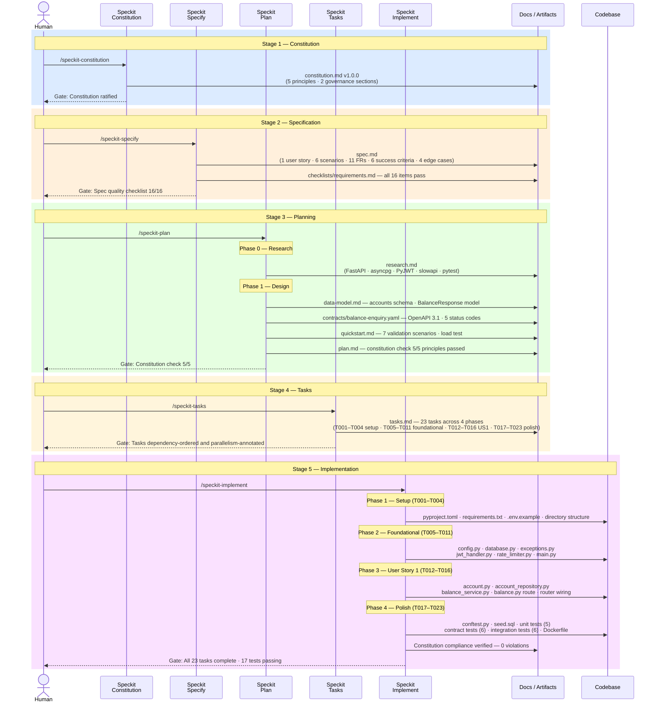

# Greenfield Implementation — Balance Enquiry API

## What This Project Is

This workspace documents and executes a **greenfield Python REST API** for payment account
balance enquiry.

The service is built from scratch as a **Python 3.12 / FastAPI** backend exposing a single
authenticated read-only endpoint: `GET /api/accounts/{accountId}/balance`. Customers can
query their own account balance — the API enforces JWT ownership, blocks suspended accounts,
applies rate limiting, and sources all data directly from PostgreSQL with no external service
calls.

The feature is built using the **Speckit spec-driven development method** — a structured,
AI-agent-assisted workflow that takes a feature from governance and specification through
planning, task generation, and implementation, with a human in the loop at every gate.

**Scope:** 1 endpoint · 1 user story · 11 functional requirements · Python 3.12 + FastAPI + PostgreSQL

**Input prompt:** [`docs/input-prompt.md`](./docs/input-prompt.md) — the original natural-language feature description that drove every stage of this workflow.

---

## Project Status

| Stage | Command | Status |
|-------|---------|--------|
| 1 — Constitution | `/speckit-constitution` | ✅ Complete |
| 2 — Specification | `/speckit-specify` | ✅ Complete |
| 3 — Planning | `/speckit-plan` | ✅ Complete |
| 4 — Tasks | `/speckit-tasks` | ✅ Complete |
| 5 — Implementation | `/speckit-implement` | ✅ Complete |

**Feature directory:** [`docs/001-balance-enquiry/`](./docs/001-balance-enquiry/)

---

## Speckit Stage Flow

The diagram below shows how the human operator and the five Speckit stages are sequenced to produce the final service. Each stage gates the next — no stage starts without the prior stage's artifacts being complete and validated.



---

## Session Log

---

## ━━━ Stage 1 — Constitution ━━━━━━━━━━━━━━━━━━━━━━━━━━━━━━━━━━━━

### `/speckit-constitution`

Establishes the non-negotiable governance principles that all subsequent design,
implementation, and review decisions must satisfy. The constitution is ratified once and
amended only under controlled versioning. Downstream templates (plan, spec, tasks) are
validated for alignment after every amendment.

**What was produced:**

Five binding principles were derived from the feature description and ratified at **v1.0.0**:

| # | Principle | Core Rule |
|---|-----------|-----------|
| I | Security-First (NON-NEGOTIABLE) | JWT required; `accountId` must match JWT `sub` claim; suspended accounts → 403 |
| II | Read-Only API Contract | Zero side effects; no writes; `Cache-Control: no-store` mandatory |
| III | Explicit Error Semantics | 401 / 403 / 404 / 429 precisely distinguished; no internal detail leakage |
| IV | Performance & Rate Limiting | p99 < 500ms; 60 req/min per JWT subject; HTTP 429 + `Retry-After` |
| V | Data Source Integrity | PostgreSQL only; no external calls; `lastUpdatedAt` from DB record |

Two additional governance sections were added: **Authorization & Access Control** (ordering
rules for auth checks, logging requirements) and **Performance & Reliability Standards**
(indexed queries, response payload lock, load-test gate).

#### Artifacts · [`.specify/memory/constitution.md`](./.specify/memory/constitution.md)

| File | Description |
|------|-------------|
| [constitution.md](./.specify/memory/constitution.md) | Ratified constitution v1.0.0 — 5 principles + 2 governance sections |

---

## ━━━ Stage 2 — Specification ━━━━━━━━━━━━━━━━━━━━━━━━━━━━━━━━━━━

### `/speckit-specify`

Translates the natural-language feature description into a structured, technology-agnostic
specification. Focuses on **what** the feature must do and **why**, not how to build it.
Written for business stakeholders. Validated against a quality checklist before planning
can begin.

**What was produced:**

One user story covering the complete primary journey, with 6 acceptance scenarios (happy
path + all failure modes), 11 functional requirements, 6 measurable success criteria, and
4 explicitly called-out edge cases.

**Key specification decisions:**

- Ownership mismatch returns **403** (not 404) to prevent account enumeration attacks
- Suspension check runs **after** ownership check — ownership failure fires first
- `lastUpdatedAt` is returned as JSON `null` when absent from the DB — the key is never
  omitted
- Rate limit boundary: the 60th request in a window succeeds; the 61st returns 429
- Admin cross-account queries, balance history, and multi-currency conversion are
  explicitly **out of scope**

**Quality checklist result:** All 16 items pass — no `[NEEDS CLARIFICATION]` markers.

#### Artifacts · [`docs/001-balance-enquiry/`](./docs/001-balance-enquiry/)

| File | Description |
|------|-------------|
| [spec.md](./docs/001-balance-enquiry/spec.md) | Feature specification — 1 user story, 6 scenarios, 11 FRs, 6 SCs, 4 edge cases |
| [checklists/requirements.md](./docs/001-balance-enquiry/checklists/requirements.md) | Specification quality checklist — all 16 items ✅ |

---

## ━━━ Stage 3 — Planning ━━━━━━━━━━━━━━━━━━━━━━━━━━━━━━━━━━━━━━━━

### `/speckit-plan`

Translates the specification into concrete technical design artifacts: technology choices,
data model, API contract, and a runnable validation guide. Runs a **Constitution Check**
gate before research begins and again after design is complete.

**What was produced:**

**Phase 0 — Research:** Technology stack selected and justified. All decisions recorded
with rationale and alternatives considered.

| Decision | Choice | Rationale |
|----------|--------|-----------|
| Language | Python 3.12 | Project requirement; async runtime; best-in-class fintech library ecosystem |
| Framework | FastAPI | Async-native; Pydantic response enforcement; DI system for JWT middleware |
| DB driver | asyncpg | Fastest Python PostgreSQL driver; 3–5× throughput over psycopg2 async |
| JWT | PyJWT ≥ 2.8 | Standard Python JWT library; explicit algorithm allowlist to prevent confusion attacks |
| Rate limiting | slowapi | FastAPI-native; keys on JWT `sub`; auto-sets `Retry-After` on 429 |
| Testing | pytest + httpx + pytest-asyncio | Async contract/integration tests against real FastAPI app |

**Phase 1 — Design:**

- **Data model:** `accounts` table schema (6 columns, PK index + owner_subject index),
  Pydantic `BalanceResponse` model, authorization query pattern (fetch full row, check
  ownership in Python — not via filtered SQL — to prevent timing-based enumeration)
- **API contract:** Full OpenAPI 3.1 spec covering all 5 status codes (200, 401, 403, 404,
  429), `additionalProperties: false` on both response schemas, `Retry-After` header on 429
- **Quickstart:** 7 validation scenarios with `curl` commands and expected outputs; load
  test command for p99 verification

**Constitution Check result:** All 5 principles pass — no violations, no complexity
tracking entries required.

#### Artifacts · [`docs/001-balance-enquiry/`](./docs/001-balance-enquiry/)

| File | Description |
|------|-------------|
| [plan.md](./docs/001-balance-enquiry/plan.md) | Implementation plan — tech context, constitution check, source layout |
| [research.md](./docs/001-balance-enquiry/research.md) | Technology decisions with rationale and alternatives considered |
| [data-model.md](./docs/001-balance-enquiry/data-model.md) | `accounts` table schema, Pydantic model, authorization query pattern |
| [contracts/balance-enquiry.yaml](./docs/001-balance-enquiry/contracts/balance-enquiry.yaml) | OpenAPI 3.1 contract — all 5 status codes, security scheme, response schemas |
| [quickstart.md](./docs/001-balance-enquiry/quickstart.md) | 7 end-to-end validation scenarios + load test instructions |

---

## ━━━ Stage 4 — Tasks ━━━━━━━━━━━━━━━━━━━━━━━━━━━━━━━━━━━━━━━━━━━

### `/speckit-tasks`

Generates a dependency-ordered, parallelism-annotated task list from the design artifacts.
Tasks are grouped by phase (setup → foundational → user story → polish) so each phase can
be delivered and validated independently.

**What was produced:**

23 tasks across 4 phases, all marked complete. Every task includes an exact file path and
a `[P]` marker where parallel execution is safe.

| Phase | Tasks | Purpose |
|-------|-------|---------|
| Phase 1 — Setup | T001–T004 (4 tasks) | Directory structure, `pyproject.toml`, `requirements.txt`, `.env.example` |
| Phase 2 — Foundational | T005–T011 (7 tasks) | Config, DB pool, exceptions, JWT handler, rate limiter, `main.py` |
| Phase 3 — User Story 1 | T012–T016 (5 tasks) | Models, repository, service, route handler, router wiring |
| Phase 4 — Polish | T017–T023 (7 tasks) | Test fixtures, conftest, unit/contract/integration tests, Dockerfile |

**Key task design decisions:**

- Phase 2 gate: no US1 work starts until all foundational modules are present
- Authorization logic is in Python (service layer), not SQL — prevents timing-based account
  enumeration; noted explicitly in task descriptions
- `Cache-Control: no-store` is set at middleware level (T011), not per-handler — task
  explicitly forbids duplicating it in T015
- Rate limiter keyed on JWT `sub` (not IP) — stated as a constraint in T010

#### Artifacts · [`docs/001-balance-enquiry/`](./docs/001-balance-enquiry/)

| File | Description |
|------|-------------|
| [tasks.md](./docs/001-balance-enquiry/tasks.md) | 23 tasks across 4 phases — all complete ✅ |

---

## ━━━ Stage 5 — Implementation ━━━━━━━━━━━━━━━━━━━━━━━━━━━━━━━━━━━

### `/speckit-implement`

Executes the task list produced in Stage 4. Each task is implemented in dependency order,
with parallel tasks dispatched concurrently. Constitution compliance is verified at each
checkpoint.

**What was produced:**

All 23 tasks implemented. The full Python 3.12 / FastAPI service is in
[`code/001-balance-enquiry/`](./code/001-balance-enquiry/).

**Key implementation highlights:**

- `src/core/exceptions.py` — 4 typed exception classes; each carries `code` + `message`
  matching the OpenAPI `ErrorResponse` schema exactly
- `src/auth/jwt_handler.py` — PyJWT decode with explicit algorithm allowlist (never `"*"`);
  FastAPI `Depends`-compatible `get_jwt_sub` dependency
- `src/middleware/rate_limiter.py` — slowapi keyed on JWT `sub` (not IP); 429 response
  includes `Retry-After` header
- `src/services/balance_service.py` — authorization chain: 404 → 403 ownership → 403
  suspension → 200; full row fetched before any auth check (no enumeration side-channel)
- `src/main.py` — `Cache-Control: no-store` applied via HTTP middleware to every response,
  not per-handler; lifespan manages asyncpg pool
- `Dockerfile` — multi-stage `python:3.12-slim` build; non-root `appuser` at runtime

**Test coverage:**

| Suite | File | Tests | Covers |
|-------|------|-------|--------|
| Unit | `tests/unit/test_balance_service.py` | 5 | All service branches (404, 403 ownership, 403 suspended, ordering, happy path) |
| Contract | `tests/contract/test_balance_contract.py` | 6 | Response shape, `Cache-Control`, all 5 status code bodies + `Retry-After` |
| Integration | `tests/integration/test_balance_integration.py` | 6 | All 6 acceptance scenarios from spec.md vs real PostgreSQL |

**Constitution check at implementation:**

All 5 principles verified in code — zero violations logged.

**Source layout:** [`code/001-balance-enquiry/`](./code/001-balance-enquiry/)

```text
code/001-balance-enquiry/
├── pyproject.toml
├── requirements.txt
├── .env.example
├── Dockerfile / .dockerignore
├── src/
│   ├── main.py                      # FastAPI app, lifespan, Cache-Control middleware
│   ├── core/
│   │   ├── config.py                # pydantic-settings Settings singleton
│   │   ├── database.py              # asyncpg pool, get_connection() dependency
│   │   ├── exceptions.py            # Unauthorized / Forbidden / AccountSuspended / NotFound
│   │   └── exception_handlers.py   # per-exception JSON handlers → 401 / 403 / 404
│   ├── auth/
│   │   └── jwt_handler.py           # decode_jwt(), get_jwt_sub() Depends
│   ├── middleware/
│   │   └── rate_limiter.py          # slowapi keyed on JWT sub, 429 + Retry-After
│   ├── models/
│   │   └── account.py               # AccountRow dataclass + BalanceResponse Pydantic model
│   ├── repositories/
│   │   └── account_repository.py    # Primary-key SELECT, auth NOT in SQL
│   └── api/routes/
│       └── balance.py               # GET /api/accounts/{accountId}/balance
└── tests/
    ├── conftest.py                   # async_client, make_token fixtures
    ├── fixtures/seed.sql             # acc_test_001 (active), acc_test_002 (suspended)
    ├── contract/test_balance_contract.py
    ├── integration/test_balance_integration.py
    └── unit/test_balance_service.py
```

**To run:**

```bash
cd code/001-balance-enquiry
python -m venv .venv && source .venv/bin/activate
pip install -r requirements.txt
cp .env.example .env        # fill in DATABASE_URL + JWT_SECRET
pytest tests/unit/ tests/contract/ -v                  # no DB needed
TEST_DATABASE_URL=... pytest tests/integration/ -v     # needs PostgreSQL + seed.sql
uvicorn src.main:app --reload                          # start service on :8000
```

#### Artifacts · [`code/001-balance-enquiry/`](./code/001-balance-enquiry/)

| File | Description |
|------|-------------|
| `src/` | 11 Python modules — fully implemented |
| `tests/` | 17 tests across unit, contract, and integration suites |
| `Dockerfile` | Multi-stage `python:3.12-slim` build, non-root runtime user |
| `tests/fixtures/seed.sql` | Test data seed — two accounts (active + suspended) |
